# 📡 مستند بصری پروژه — FAA NOTAM Consumer

> سیستم دریافت، ذخیره، فیلتر و نمایش بلادرنگ **NOTAM** (اطلاعیه‌های هوانوردی) از سرویس **FAA SWIM / AIM FNS**
>
> تاریخ مستند: ۱۴۰۵/۰۴/۲۳ (2026-07-14) — نسخه ۱.۰

---

## 📑 فهرست

1. [نگاه کلی](#۱-نگاه-کلی)
2. [معماری سیستم](#۲-معماری-سیستم)
3. [جریان داده (Data Flow)](#۳-جریان-داده-data-flow)
4. [ساختار پوشه‌ها](#۴-ساختار-پوشهها)
5. [مدل داده (Database)](#۵-مدل-داده-database)
6. [API Endpoints](#۶-api-endpoints)
7. [منطق Consumer و فیلتر](#۷-منطق-consumer-و-فیلتر)
8. [منطق اعلان (Alert Matching)](#۸-منطق-اعلان-alert-matching)
9. [Frontend](#۹-frontend)
10. [زیرساخت و اجرا](#۱۰-زیرساخت-و-اجرا)
11. [تکنولوژی‌ها](#۱۱-تکنولوژیها)
12. [نقاط ضعف و بدهی فنی](#۱۲-نقاط-ضعف-و-بدهی-فنی)
13. [نقشه راه پیشنهادی](#۱۳-نقشه-راه-پیشنهادی)

---

## ۱. نگاه کلی

**NOTAM** = *Notice to Airmen*؛ اطلاعیه‌هایی درباره وضعیت باند، تجهیزات ناوبری، محدودیت‌های فضای هوایی و... که خلبانان باید بدانند.

این پروژه به‌صورت زنده به broker پیام **Solace** فرودگاه FAA وصل می‌شود، پیام‌های **XML** استاندارد را می‌گیرد، آن‌ها را به فرمت استاندارد **ICAO / Jeppesen** تبدیل می‌کند، در **PostgreSQL** ذخیره می‌کند و از طریق یک **REST API** و **داشبورد React** با قابلیت **اعلان بلادرنگ صوتی/تصویری** به کاربر نمایش می‌دهد.

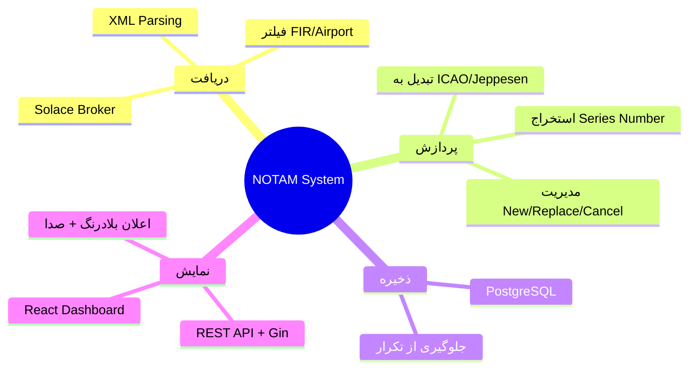

> ⚠️ **نکته تاریخی:** این پروژه از یک «BaseProject فروش خودرو» مشتق شده و طبق `RESTRUCTURE_PLAN.md` به NOTAM تبدیل شده. بقایای آن ساختار (pkg/logging، limiter، service_errors، metrics) هنوز موجود است.

---

## ۲. معماری سیستم

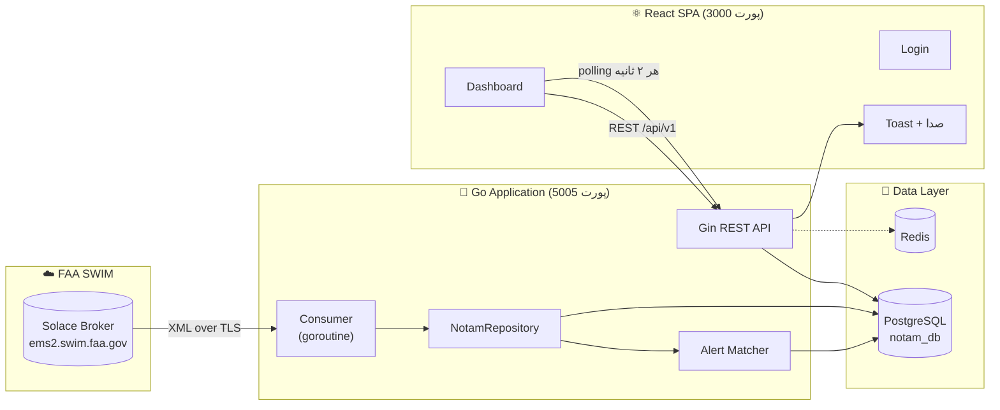

**دو بخش هم‌زمان در یک پروسه Go اجرا می‌شوند** ([main.go](src/main.go)):

| بخش | نوع اجرا | وظیفه |
|------|---------|--------|
| **Consumer** | goroutine پس‌زمینه | اتصال دائم به Solace، دریافت و ذخیره NOTAM |
| **API Server** | main thread | پاسخ به درخواست‌های REST فرانت‌اند |

---

## ۳. جریان داده (Data Flow)

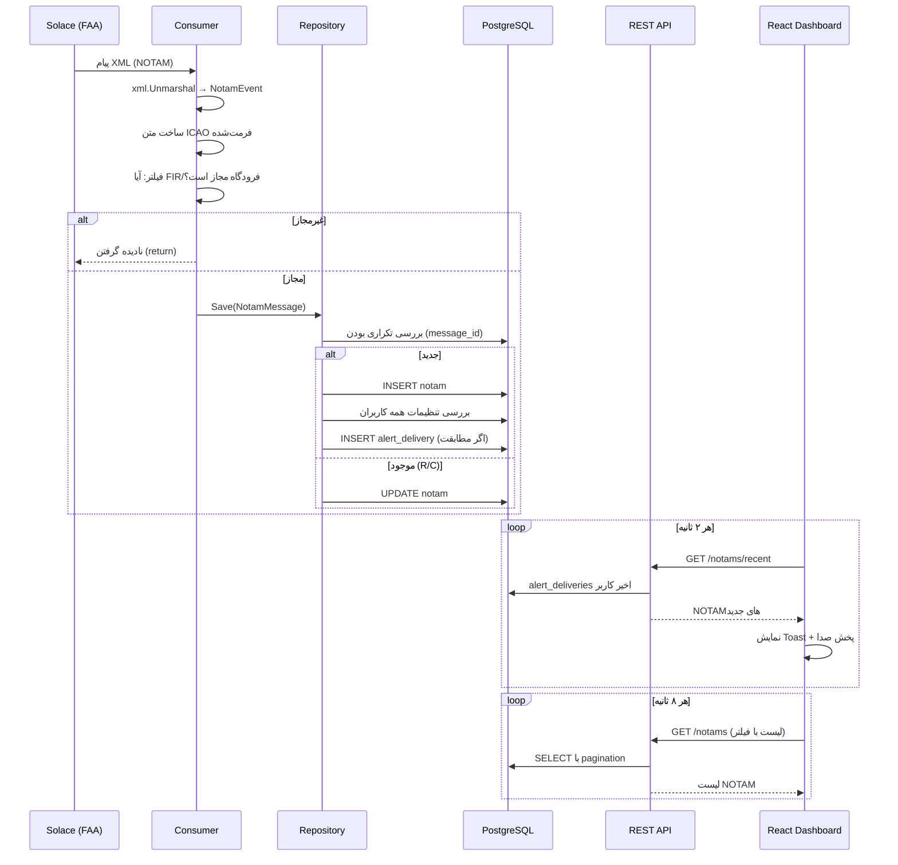

---

## ۴. ساختار پوشه‌ها

```
BaseProject/
│
├── 📄 docker-compose.yml          # ارکستراسیون: consumer + postgres + pgadmin + redis + frontend
├── 📄 Readme.md
├── 📄 RESTRUCTURE_PLAN.md         # تاریخچه تبدیل از car-sale به NOTAM
│
├── 📁 src/                        # ── Backend (Go) ──
│   ├── main.go                    # نقطه ورود: Consumer + API
│   ├── Dockerfile
│   ├── go.mod / go.sum
│   │
│   ├── 📁 config/                 # Viper، سه محیط (dev/docker/prod)
│   │   ├── config.go
│   │   └── config-*.yml
│   │
│   ├── 📁 internal/               # منطق اصلی دامنه
│   │   ├── app/application.go     # ساختار Application (Consumer + Repo)
│   │   ├── messaging/
│   │   │   ├── solace_queue_consumer.go  # ⭐ اتصال Solace + پارس XML
│   │   │   ├── notam_filter.go           # لیست FIR/Airport مجاز
│   │   │   ├── message.go / consumer.go  # interfaceها
│   │   │   └── solace_message.go
│   │   └── storage/
│   │       ├── notam_repository.go       # ⭐ تبدیل event→model، regex series
│   │       ├── alert_match.go            # ⭐ منطق تطابق اعلان
│   │       └── fake_repository.go
│   │
│   ├── 📁 data/                   # لایه دسترسی به داده
│   │   ├── cache/redis.go
│   │   └── db/
│   │       ├── postgres.go
│   │       ├── model/             # Notam, Airport, Runway, AlertSettings, AlertDelivery
│   │       └── migrations/1_Init.go
│   │
│   ├── 📁 api/                    # لایه HTTP (Gin)
│   │   ├── api.go                 # راه‌اندازی سرور + روت‌ها + Swagger
│   │   ├── handlers/              # notam, auth, health
│   │   ├── routers/               # notam, auth, health
│   │   ├── middleware/            # cors, auth, logger, recovery, limiter
│   │   ├── helper/                # BaseResponse، status code mapping
│   │   └── validation/            # mobile, password, custom
│   │
│   ├── 📁 pkg/                    # ابزار مشترک (میراث BaseProject)
│   │   ├── logging/               # zap / zerolog
│   │   ├── limiter/               # rate limiter (IP)
│   │   ├── metrics/               # Prometheus (بلااستفاده)
│   │   └── service_errors/
│   │
│   └── 📁 docs/                   # Swagger تولیدشده
│
├── 📁 frontend/                   # ── Frontend (React + Vite + TS) ──
│   ├── package.json
│   ├── vite.config.ts             # proxy /api → :5005
│   └── src/
│       ├── App.tsx                # روتینگ + ToastContainer
│       ├── contexts/AuthContext.tsx
│       ├── api/client.ts          # ⭐ همه فراخوانی‌های API
│       ├── pages/                 # Login, Dashboard
│       ├── components/            # NotamList, FiltersForm, AlertSettings, AlertPopup...
│       └── utils/                 # alertSound, notamCancel
│
└── 📁 docker/
    └── redis/redis.conf
```

⭐ = فایل‌های هسته‌ی منطق کسب‌وکار

---

## ۵. مدل داده (Database)

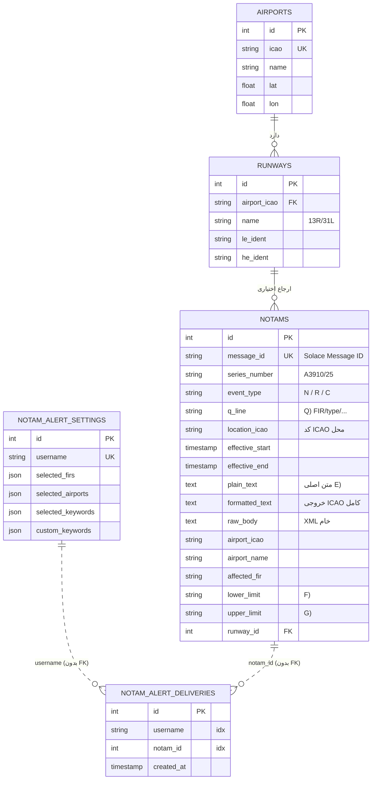

**نکات کلیدی مدل:**
- مدل `Notam` دقیقاً منطبق بر فیلدهای استاندارد **ICAO** است (بندهای Q, A, B, C, D, E, F, G).
- `event_type`: `N`=جدید، `R`=جایگزین (Replace)، `C`=لغو (Cancel).
- بین NOTAM و Airport **کلید خارجی نیست** — چون NOTAMها از هزاران فرودگاه FAA می‌آیند که لزوماً در جدول airports نیستند.
- تنظیمات و تحویل اعلان بر اساس **username رشته‌ای** است (بدون جدول users واقعی).

---

## ۶. API Endpoints

**Base URL:** `http://localhost:5005/api/v1`
**فرمت پاسخ استاندارد:** `BaseHttpResponse { success, result, error, resultCode }`

| متد | مسیر | Auth | توضیح |
|-----|------|:----:|-------|
| `GET`  | `/health/` | ❌ | health check |
| `POST` | `/auth/login` | ❌ | لاگین → توکن |
| `GET`  | `/notams` | ❌ | لیست با فیلتر و صفحه‌بندی |
| `GET`  | `/notams/:id` | ❌ | یک NOTAM با ID |
| `GET`  | `/notams/by-series` | ❌ | یک NOTAM با شماره سریال |
| `GET`  | `/notams/alert-options` | ❌ | لیست FIR/فرودگاه مجاز |
| `GET`  | `/notams/alert-settings` | ✅ | خواندن تنظیمات اعلان کاربر |
| `PUT`  | `/notams/alert-settings` | ✅ | ذخیره تنظیمات اعلان کاربر |
| `GET`  | `/notams/recent` | ✅ | NOTAMهای تحویل‌شده اخیر (برای polling) |

**فیلترهای `GET /notams`:** `seriesNumber`, `eventType`, `locationIcao`, `airportIcao`, `airportName`, `affectedFir`, `plainText`, `from`, `to`, `limit`, `offset` (هم camelCase هم snake_case پشتیبانی می‌شود).

📖 مستندات تعاملی: `http://localhost:5005/swagger/index.html`

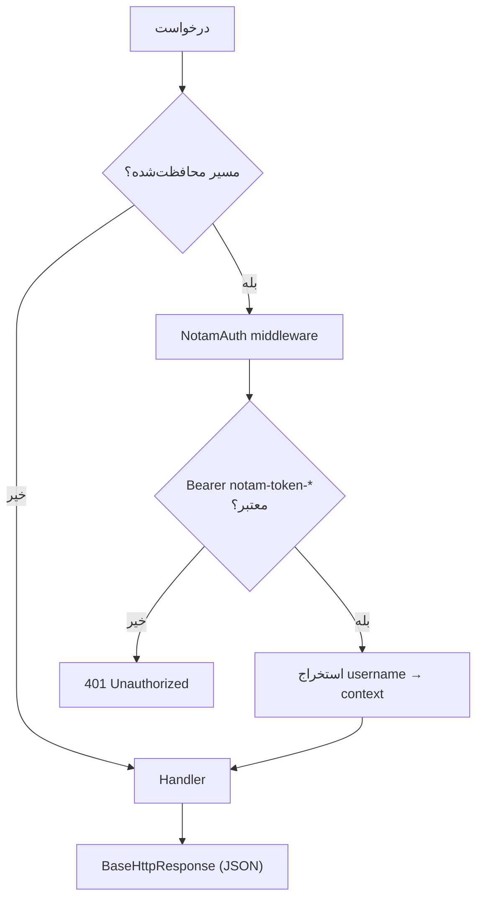

---

## ۷. منطق Consumer و فیلتر

فایل: [solace_queue_consumer.go](src/internal/messaging/solace_queue_consumer.go)

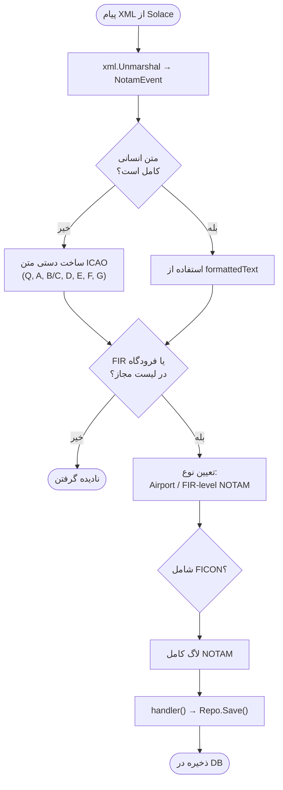

**فیلتر مجاز** ([notam_filter.go](src/internal/messaging/notam_filter.go)):
- `AllowedFIRs` — حدود ۸۰ کد FIR (خاورمیانه، آسیا، آفریقا، اروپا، اروپای شرقی)
- `AllowedAirports` — حدود ۳۰۰+ کد ICAO فرودگاه
- فقط NOTAMهایی که به این مناطق مربوط‌اند ذخیره می‌شوند.

**پیچیدگی استخراج Series Number** ([notam_repository.go](src/internal/storage/notam_repository.go)) — سه لایه fallback:
1. از فیلدهای XML ساختاریافته (`series` + `number` + `year`)
2. با regex از متن (`A1477/26`, `0046/26`, `M0137/26`)
3. از `xovernotamID` در XML خام (برای NOTAMهای R/C)

---

## ۸. منطق اعلان (Alert Matching)

فایل: [alert_match.go](src/internal/storage/alert_match.go)

هنگام ذخیره‌ی هر NOTAM جدید، تنظیمات **همه‌ی کاربران** بررسی و در صورت تطابق، یک رکورد `alert_delivery` ثبت می‌شود.

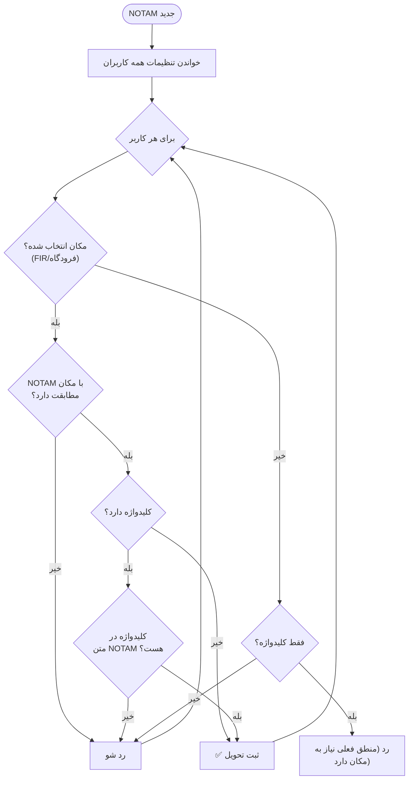

**قانون:** برای اعلان، NOTAM باید **هم** در محدوده‌ی FIR/فرودگاه انتخابی باشد **و** (در صورت انتخاب کلیدواژه) حداقل یک کلیدواژه در متنش وجود داشته باشد.

**کلیدواژه‌های پیش‌فرض:** `AD CLSD`, `RWY`, `ILS`, `GPS`, `SID`, `STAR`, `VOR`, `DME`, `SECTOR` + کلیدواژه‌های سفارشی کاربر.

---

## ۹. Frontend

**استک:** React 18 + Vite 5 + TypeScript + React Router 6 + react-toastify — بدون کتابخانه state management (فقط Context + localStorage).

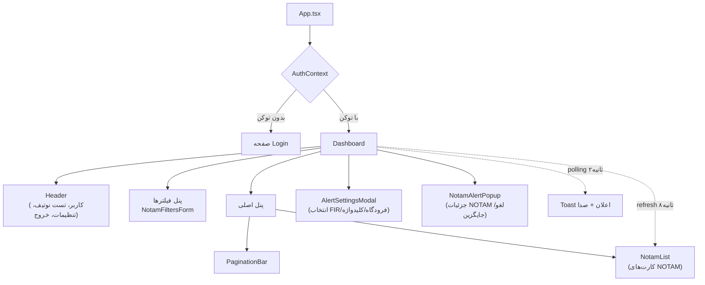

**قابلیت‌های کلیدی داشبورد** ([Dashboard.tsx](frontend/src/pages/Dashboard.tsx)):
- ✅ لیست NOTAM با فیلتر و صفحه‌بندی
- 🔄 به‌روزرسانی خودکار لیست هر **۸ ثانیه**
- 🔔 polling اعلان از `/recent` هر **۲ ثانیه** → نمایش Toast
- 🔊 پخش **صدای هشدار** (نیاز به فعال‌سازی کاربر به‌دلیل محدودیت مرورگر)
- 🎨 رنگ Toast بر اساس نوع: سبز=جدید، زرد=جایگزین، قرمز=لغو
- 🔍 باز کردن NOTAM لغو/جایگزین‌شده در پاپ‌آپ
- 🌐 رابط کاربری **راست‌به‌چپ (فارسی)**

---

## ۱۰. زیرساخت و اجرا

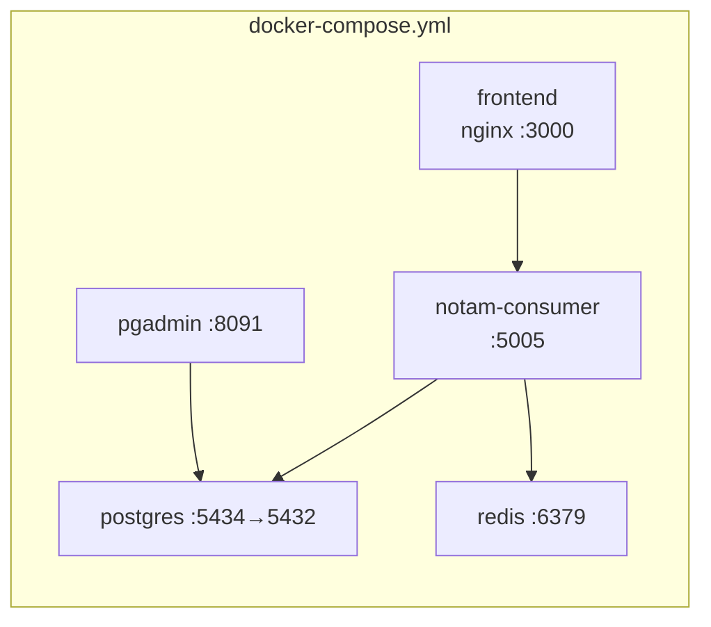

**اجرا:**
```bash
docker compose up -d --build
```

| سرویس | پورت | آدرس |
|-------|------|------|
| Frontend | 3000 | http://localhost:3000 |
| Backend API | 5005 | http://localhost:5005/api/v1 |
| Swagger | 5005 | http://localhost:5005/swagger/index.html |
| PostgreSQL | 5434 | — |
| pgAdmin | 8091 | http://localhost:8091 |
| Redis | 6379 | — |

**اجرای dev فرانت:** `cd frontend && npm run dev` (پورت 3000، proxy به 5005)

**متغیرهای محیطی مهم:** `APP_ENV`, `SOLACE_HOST/VPN/USERNAME/PASSWORD/QUEUE`, `AUTH_USER`, `AUTH_PASS`

---

## ۱۱. تکنولوژی‌ها

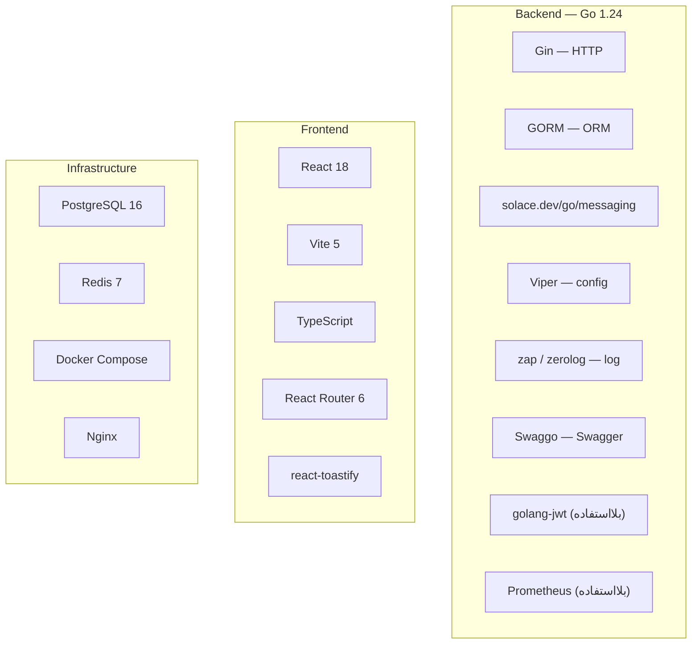

---

## ۱۲. نقاط ضعف و بدهی فنی

| # | شدت | موضوع | توضیح |
|---|:---:|-------|-------|
| 1 | 🔴 | **احراز هویت ضعیف** | رمز `admin/admin` هاردکد، توکن ثابت `notam-token-<user>` بدون JWT/انقضا؛ هرکس می‌تواند توکن جعل کند |
| 2 | 🔴 | **افشای credential** | یوزر/پسورد Solace و پسورد DB مستقیم در `main.go` و `docker-compose.yml` کامیت شده |
| 3 | 🟡 | **اعلان مبتنی بر polling** | فرانت هر ۲ ثانیه `/recent` را صدا می‌زند؛ به‌جای WebSocket/SSE |
| 4 | 🟡 | **بار روی DB** | `evaluateAlertDeliveries` برای هر NOTAM، تنظیمات همه کاربران را می‌خواند |
| 5 | 🟡 | **بلااستفاده‌ها** | Redis، limiter، metrics تعریف شده‌اند اما عملاً استفاده نمی‌شوند |
| 6 | 🟡 | **پارس XML شکننده** | استخراج series با چند regex و fallback، بدون تست کافی |
| 7 | 🟢 | **تک‌کاربره عملی** | نبود جدول users واقعی؛ تنظیمات بر اساس رشته‌ی username |
| 8 | 🟢 | **نبود تست** | تست واحد/یکپارچه دیده نشد |

---

## ۱۳. نقشه راه پیشنهادی

```mermaid
flowchart LR
    subgraph P1["فاز ۱ — امن‌سازی"]
        A1[جدول Users + هش رمز]
        A2[JWT با انقضا]
        A3[انتقال secrets به env/vault]
    end
    subgraph P2["فاز ۲ — بلادرنگ"]
        B1[WebSocket/SSE برای اعلان]
        B2[حذف polling]
    end
    subgraph P3["فاز ۳ — مدیریت"]
        C1[پنل مدیریت FIR/فرودگاه]
        C2[نقش‌ها و دسترسی]
    end
    subgraph P4["فاز ۴ — بلوغ"]
        D1[تست واحد/یکپارچه]
        D2[نقشه و آمار]
        D3[بهینه‌سازی Alert Matching]
    end
    P1 --> P2 --> P3 --> P4
```

**اولویت پیشنهادی برای شروع توسعه:**
1. 🔐 **امن‌سازی** (Users واقعی + JWT + خارج‌کردن secrets)
2. ⚡ **WebSocket** برای اعلان بلادرنگ به‌جای polling
3. 🛠️ **پنل مدیریت** فرودگاه/FIR (به‌جای لیست هاردکد در کد)
4. 🧪 **تست و مانیتورینگ**

---

> این مستند از بررسی مستقیم کد تولید شده و ممکن است با تغییر پروژه نیاز به به‌روزرسانی داشته باشد.
