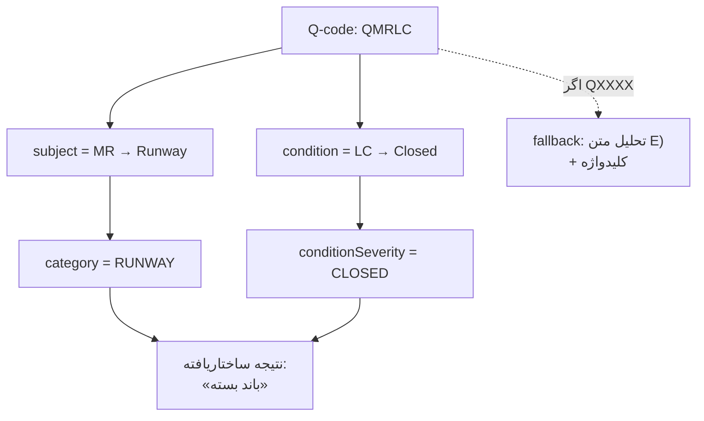
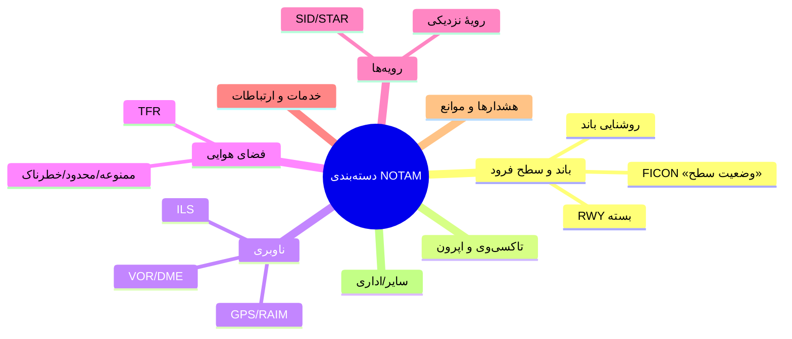
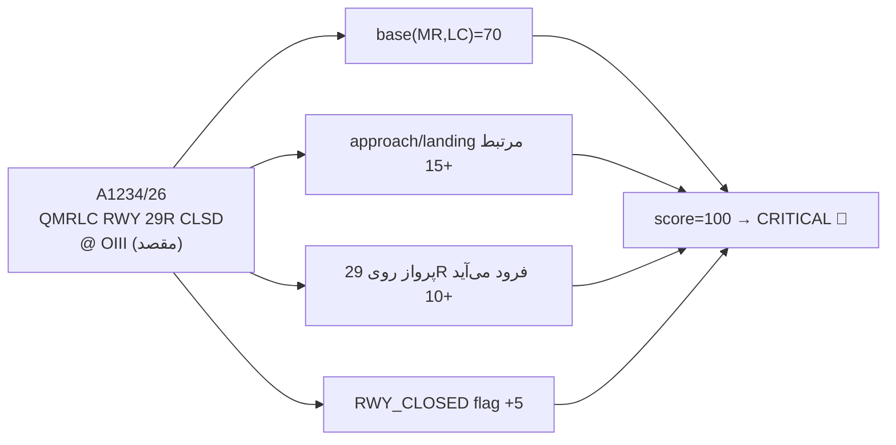
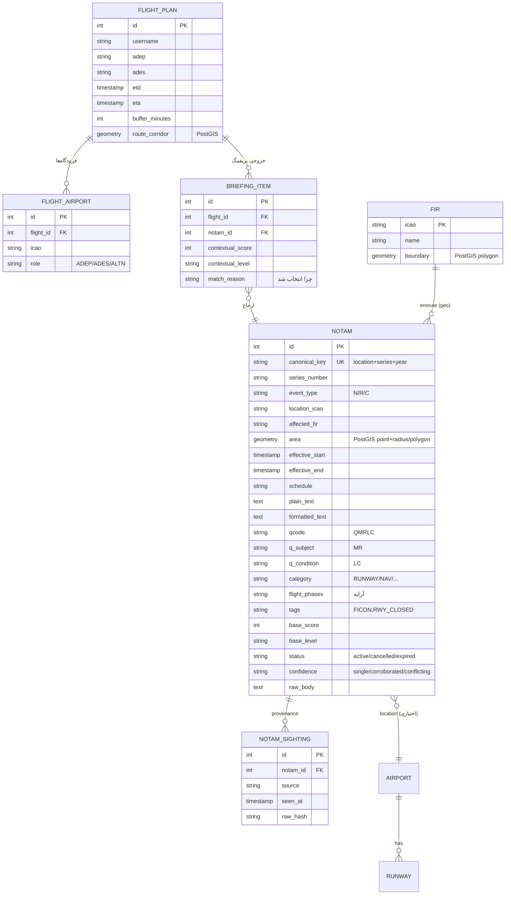
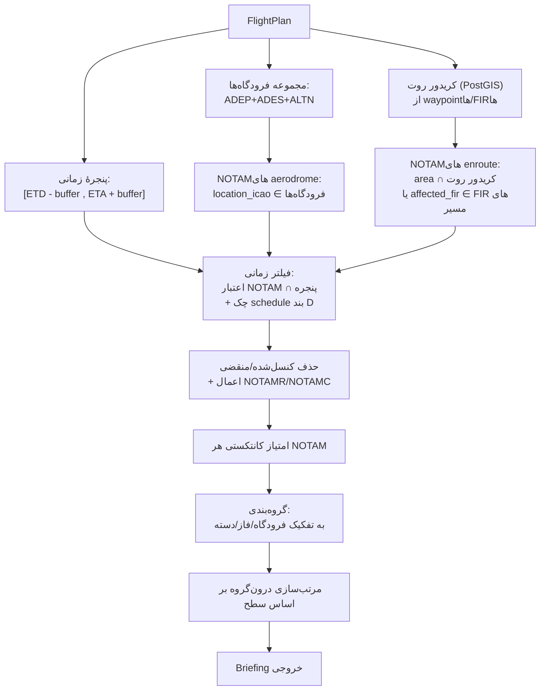
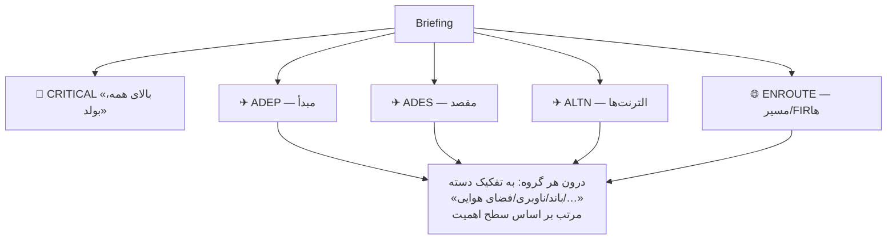
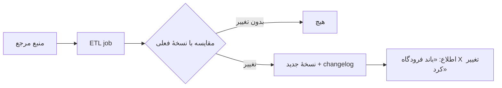
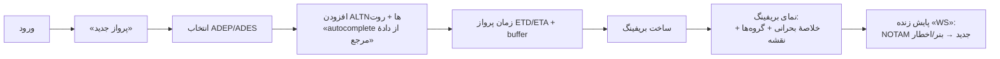

# تحلیل NOTAM و موتور بریفینگ

> این سند «مغز» سیستم است: چطور هر NOTAM را دقیق می‌فهمیم (دیکد Q-code)، دسته‌بندی و امتیازدهی می‌کنیم، و چطور NOTAMهای یک پرواز را می‌سازیم و مرتب می‌کنیم.

فهرست:
1. [ساختار استاندارد NOTAM](#۱-ساختار-استاندارد-notam)
2. [دیکد Q-code — پایهٔ دقت](#۲-دیکد-q-code)
3. [دسته‌بندی (Classification)](#۳-دستهبندی)
4. [امتیاز اهمیت (Importance Scoring)](#۴-امتیاز-اهمیت)
5. [مدل داده](#۵-مدل-داده)
6. [موتور بریفینگ — تطبیق پرواز](#۶-موتور-بریفینگ)
7. [رتبه‌بندی و ارائه](#۷-رتبهبندی-و-ارائه)
8. [دادهٔ مرجع](#۸-دادهٔ-مرجع)
9. [تجربهٔ کاربری بریفینگ](#۹-تجربهٔ-کاربری)

---

## ۱. ساختار استاندارد NOTAM

هر NOTAM ICAO از فیلدهای Q و A تا G تشکیل شده:

```
(A1234/26 NOTAMN
 Q) OIIX/QMRLC/IV/NBO/A/000/999/3540N05111E005
 A) OIII  B) 2607150600  C) 2607152359
 D) 0600-1200
 E) RWY 11L/29R CLSD DUE WIP
 F) SFC  G) 999FT AMSL)
```

| بند | معنی | استفادهٔ ما |
|-----|------|-------------|
| **Q)** | خط ماشین‌خوان: FIR / Q-code / ترافیک / هدف / دامنه / حد پایین / حد بالا / مختصات+شعاع | **کلید دسته‌بندی و امتیازدهی دقیق** |
| **A)** | مکان (ICAO فرودگاه/FIR) | تطبیق مکانی |
| **B) / C)** | شروع/پایان اعتبار | تطبیق زمانی با پنجرهٔ پرواز |
| **D)** | زمان‌بندی (schedule) | فعال‌بودن در ساعت پرواز |
| **E)** | متن انسانی | نمایش + استخراج کلیدواژه |
| **F) / G)** | حد پایین/بالای ارتفاع | ارتباط با فاز/ارتفاع پرواز |

---

## ۲. دیکد Q-code

Q-code قلب تحلیل دقیق است. ساختار: `Q` + **۲ حرف موضوع** + **۲ حرف وضعیت**.

```
Q M R L C
  └┬┘ └┬┘
موضوع  وضعیت
(MR=Runway) (LC=Closed)  →  «باند بسته است»
```

### گروه‌های موضوع (حرف دوم Q-code)

| حرف | دامنه موضوع | مثال |
|-----|-------------|------|
| `A` | سازمان فضای هوایی | ساختار مسیرها |
| `C` | ارتباطات/نظارت | رادار، CPDLC |
| `F` | تسهیلات و خدمات | سوخت، آتش‌نشانی |
| `G` | خدمات GNSS | GPS، RAIM، WAAS |
| `I` | ILS / MLS | گلایدسلوپ، لوکالایزر |
| `L` | روشنایی | چراغ باند، PAPI |
| `M` | سطح حرکت و فرود | **باند، تاکسی‌وی، اپرون** |
| `N` | ناوبری ترمینال/enroute | VOR, DME, NDB |
| `O` | سایر | متفرقه |
| `P` | رویه‌های ATC | SID, STAR, رویهٔ نزدیکی |
| `R` | محدودیت فضای هوایی | ممنوعه، خطرناک، محدود |
| `S` | خدمات ATS/VOLMET | برج، اطلاعات پرواز |
| `W` | هشدارها | مانع، تیراندازی، پهپاد |

### گروه‌های وضعیت (حرف چهارم Q-code)

| حرف | معنی | شدت نسبی |
|-----|------|----------|
| `A` | Availability (AS=غیرقابل‌استفاده، AU=در دسترس نیست) | بالا |
| `C` | Changes (CN=کنسل، CA=فعال شد، CC=تکمیل شد) | متغیر |
| `H` | Hazard conditions | بالا |
| `L` | Limitations (LC=بسته، LP=ممنوع، LT=محدود) | بالا (LC بحرانی) |
| `T` | Trigger NOTAM | اطلاعی |
| `X` | XX = متن آزاد (زبان طبیعی) | نامشخص → fallback |

**راهبرد:** جدول کامل Q-code (ICAO Doc 8126 / Annex 15) در `pipeline/qcode` به‌صورت داده‌محور (map/جدول) پیاده می‌شود؛ خروجی: `{subjectCategory, conditionType, humanSubject, humanCondition}`. این deterministic است → **دقت بالا بدون LLM**.



> اگر Q-code موجود نبود یا `XX` بود (متن آزاد)، به تحلیل متن `E)` با کلیدواژه‌ها و الگوها fallback می‌کنیم (مثل FICON, RWY CLSD, ILS U/S).

---

## ۳. دسته‌بندی

هر NOTAM به یک **دستهٔ اصلی** و **زیرمشخصه‌ها** نگاشت می‌شود:



خروجی هر NOTAM شامل:
- `category` (enum اصلی)
- `subject` / `condition` (از Q-code)
- `flightPhase[]` — به کدام فاز مربوط است: `DEPARTURE`, `ENROUTE`, `APPROACH`, `LANDING`, `GROUND`
- `tags[]` — پرچم‌های ویژه: `FICON`, `RWY_CLOSED`, `AD_CLOSED`, `ILS_OUT`, `GPS_OUT`, `OBSTACLE`

---

## ۴. امتیاز اهمیت

هدف: به هر NOTAM یک **سطح** و **امتیاز عددی (۰–۱۰۰)** بدهیم تا خلبان سریع مورد بحرانی را ببیند.

### تابع امتیاز (قاعده‌محور، شفاف و قابل‌ممیزی)

```
score = base(subject, condition)                     ← وزن پایه از جدول Q-code
      + phaseRelevance(flightPhase, flightContext)   ← آیا فاز مرتبط با این پرواز است؟
      + assetMatch(notam, flightAssets)              ← آیا دقیقاً باند/رویه/ناوید موردِ استفادهٔ پرواز را می‌زند؟
      + specialFlags(FICON, AD_CLOSED, ...)          ← پرچم‌های بحرانی
      + verticalOverlap(F/G, flightLevels)           ← هم‌پوشانی ارتفاعی
      - staleness/expiry adjustments
```

خروجی به **سطوح** نگاشت می‌شود:

| سطح | امتیاز | نمونه | نمایش |
|-----|--------|-------|--------|
| 🔴 **CRITICAL** | ۸۰–۱۰۰ | باند مقصد بسته، فرودگاه بسته، ILSِ باندِ فرود out | **بولد، بالای لیست، اخطار** |
| 🟠 **HIGH** | ۶۰–۷۹ | FICON، بستن تاکسی‌وی اصلی، GPS out در approach | برجسته |
| 🟡 **MEDIUM** | ۳۵–۵۹ | محدودیت جزئی، روشنایی ثانویه | عادی |
| 🟢 **LOW** | ۱۵–۳۴ | تغییرات اداری، ناوید کم‌اهمیت | جمع‌شده |
| ⚪ **INFO** | ۰–۱۴ | اطلاعی/trigger | جمع‌شده |

### مثال محاسبه



**اصول مهم امتیازدهی:**
- کاملاً **قاعده‌محور و قابل‌توضیح** است — برای safety-critical، هر امتیاز باید قابل ردیابی باشد (چرا CRITICAL شد؟). جدول وزن‌ها نسخه‌دار و قابل‌بازبینی توسط کارشناس هوانوردی.
- `assetMatch` نیازمند دادهٔ مرجع دقیق است (باندها/رویه‌های هر فرودگاه) — به همین دلیل دادهٔ مرجع حیاتی است.
- امتیاز **وابسته به کانتکست پرواز** است: یک NOTAM ممکن است برای یک پرواز CRITICAL و برای دیگری LOW باشد (مثلاً باندی که این پرواز از آن استفاده نمی‌کند). پس امتیاز نهایی در زمان ساخت بریفینگ محاسبه می‌شود، ضمن اینکه یک «امتیاز پایهٔ مستقل از پرواز» هم برای فهرست عمومی ذخیره می‌شود.
- فاز بعد: LLM می‌تواند **توضیح** و **خلاصه** بیفزاید، اما **تصمیم سطح‌بندی همچنان قاعده‌محور** می‌ماند (اعتماد).

---

## ۵. مدل داده

توسعهٔ مدل فعلی `Notam` + جداول جدید:



نکات:
- `NOTAM.area` (PostGIS) از مختصات+شعاع خط Q ساخته می‌شود → تطبیق جغرافیایی روت.
- `canonical_key` جایگزین `message_id` به‌عنوان کلید یکتا (برای اجماع چندمنبعی).
- `base_score`/`base_level` مستقل از پرواز؛ `contextual_score`/`contextual_level` در `BRIEFING_ITEM` وابسته به پرواز.

---

## ۶. موتور بریفینگ

ورودی: `FlightPlan{ ADEP, ADES, ALTN[], route(FIRs/waypoints), ETD, ETA, buffer }`.
خروجی: مجموعهٔ NOTAMهای مرتبط، دسته‌بندی و رتبه‌بندی‌شده.



### تطبیق زمانی دقیق
- بازهٔ اعتبار NOTAM `[B, C]` باید با پنجرهٔ پرواز `[ETD-buffer, ETA+buffer]` **هم‌پوشانی** داشته باشد.
- اگر بند `D)` (schedule) وجود دارد، باید بررسی شود که در ساعات واقعی عبور/حضور پرواز فعال است (مثلاً NOTAM فقط ۰۶۰۰–۱۲۰۰ فعال است).
- NOTAMهای دائمی/بدون پایان (`PERM`, `EST`) هم پوشش داده می‌شوند.

### تطبیق مکانی enroute
- کریدور روت به‌صورت buffer دور خط مسیر (مثلاً ±X نات‌مایل) در PostGIS ساخته می‌شود.
- `ST_Intersects(notam.area, route_corridor)` برای NOTAMهای ناوبری/فضای هوایی.
- fallback بر اساس FIR وقتی مختصات دقیق نیست.

### چابکی و سرعت
- ایندکس‌های GiST روی geometry + ایندکس روی `effective_start/end`, `location_icao`, `status`.
- کش نتیجهٔ بریفینگ در Redis (کلید = هش FlightPlan + نسخهٔ دادهٔ NOTAM) با invalidation هنگام رسیدن NOTAM جدید مرتبط.
- هدف کارایی: ساخت بریفینگ برای ۵ فرودگاه + روت < ~۳۰۰ms در حالت گرم.

---

## ۷. رتبه‌بندی و ارائه

خروجی بریفینگ برای هر پرواز به این شکل گروه‌بندی می‌شود:



- ردیف بالای بریفینگ: **خلاصهٔ بحرانی** (همهٔ CRITICALها یک‌جا، بولد، با آیکن).
- هر NOTAM: سطح (رنگ/آیکن)، دستهٔ ترجمه‌شده، خلاصهٔ ماشینی («باند 29R بستهٔ مقصد»)، متن کامل قابل‌بازشدن، دلیل انتخاب (`match_reason`).
- برچسب اطمینان منبع (از [RELIABILITY.md](RELIABILITY.md)).
- خروجی قابل export (PIB) برای فازهای بعد.

---

## ۸. دادهٔ مرجع

دقت بریفینگ مستقیماً به دقت دادهٔ مرجع وابسته است.

| دیتاست | منبع پیشنهادی | کاربرد |
|--------|----------------|--------|
| فرودگاه‌ها (ICAO, نام, مختصات, ارتفاع) | OurAirports (باز) / FAA NASR | تطبیق مکانی، نمایش |
| باندها (نام، جهت، طول) | OurAirports / NASR | `assetMatch` امتیازدهی |
| ناویدها (VOR/DME/ILS/NDB) | NASR / منابع باز | تطبیق ناوبری |
| مرزهای FIR (polygon) | GeoJSON مرجع هوانوردی | تطبیق enroute |

**ETL نسخه‌دار + تشخیص تغییر:**



- هر دیتاست نسخه‌بندی می‌شود؛ diff بین نسخه‌ها ثبت و در صورت تغییرِ فرودگاه‌های پرکاربرد، هشدار داده می‌شود.
- اجرای دوره‌ای (مثلاً روزانه/هفتگی) + امکان اجرای دستی.

---

## ۹. تجربهٔ کاربری بریفینگ

جریان کاربر:



الزامات UX (طبق تأکید کارفرما بر سرعت و جذابیت):
- **سرعت:** autocomplete فرودگاه/waypoint فوری از کش؛ بریفینگ با اسکلتون و بارگذاری تدریجی.
- **جذابیت و وضوح:** رنگ‌بندی سطوح، آیکن دسته‌ها، بولد بحرانی‌ها، نقشهٔ روت با نقاط NOTAM.
- **اعتماد:** نوار وضعیت منابع همیشه دیده شود؛ زمان تازگی داده مشخص.
- **زنده:** پرواز فعال subscribe می‌شود؛ NOTAM جدید مرتبط → toast/بنر؛ بحرانی → اخطار صوتی+بصری اجباری.
- **RTL فارسی** با ترجمهٔ اصطلاحات فنی + نگه‌داشتن کدهای استاندارد (ICAO) به‌صورت لاتین.
