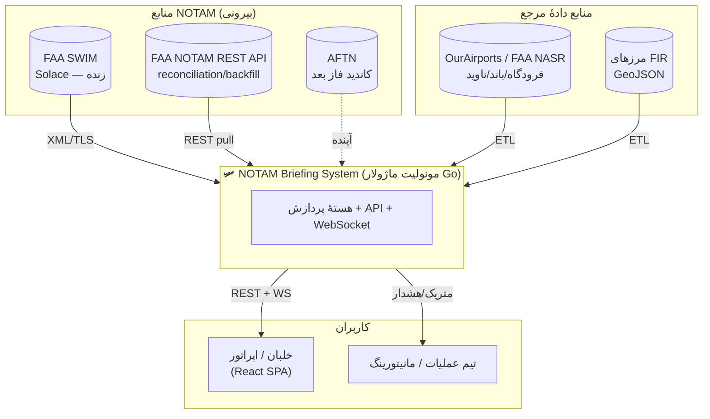
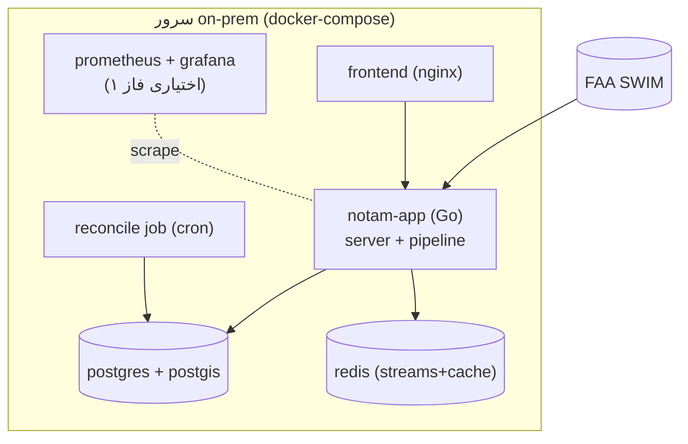

# معماری فاز ۱ — مونولیت ماژولار

> این سند معماری هدف فاز ۱ را تعریف می‌کند: ماژول‌ها، مرزها، جریان داده، و تصمیمات فنی. اصلِ راهنما: **تکاملی روی کد موجود، ماژولار برای تفکیک آینده**.

---

## ۱. نمای کلان (C4 — Context)



---

## ۲. ماژول‌های داخلی (Container/Component)

مونولیت واحد، اما با مرزهای ماژولی سخت‌گیرانه. هر ماژول یک پکیج Go با interface عمومی مشخص است.

```mermaid
flowchart LR
    subgraph ingest["① ingest — دریافت"]
        A1[Solace Adapter]
        A2[FAA REST Adapter]
        A3[AFTN Adapter «آینده»]
        A1 & A2 & A3 --> NRM["Normalizer<br/>→ RawNotamMessage"]
    end

    STREAM[["Redis Streams<br/>(صف پایدار داخلی)"]]

    subgraph pipeline["② pipeline — پردازش"]
        P1[Parse — XML/ICAO]
        P2[Q-code Decode]
        P3[Dedupe + Reconcile «اجماع»]
        P4[Classify + Score]
        P1 --> P2 --> P3 --> P4
    end

    subgraph reference["③ reference — دادهٔ مرجع"]
        R1[Airports/Runways/Navaids]
        R2[FIR Geometry «PostGIS»]
        R3[ETL + Versioning + Change-Detect]
    end

    subgraph store["④ storage"]
        DB[("PostgreSQL + PostGIS")]
        CACHE[("Redis — کش داغ")]
    end

    subgraph briefing["⑤ briefing — بریفینگ"]
        B1[Flight Model]
        B2[Matching Engine «geo+time»]
        B3[Ranking]
    end

    subgraph alerting["⑥ alerting"]
        AL1[Subscription Match]
        AL2[Push «WS»]
    end

    subgraph api["⑦ api"]
        H1[REST Handlers]
        H2[WebSocket Hub]
    end

    subgraph obs["⑧ observability"]
        O1[Metrics]
        O2[Health + Source Liveness]
        O3[Gap Detector]
    end

    ingest --> STREAM --> pipeline
    pipeline --> store
    reference --> store
    P4 --> alerting
    briefing --> store
    reference --> briefing
    api --> briefing
    api --> store
    alerting --> H2
    obs -.نظارت.- ingest & pipeline & store
```



### شرح ماژول‌ها

| # | ماژول | مسئولیت | interface کلیدی |
|---|--------|---------|-----------------|
| ① | **ingest** | آداپتور هر منبع؛ نرمال‌سازی به `RawNotamMessage`؛ نوشتن در استریم؛ **ack پس از نوشتن پایدار** | `SourceAdapter { Start(ctx, emit func(RawNotamMessage)) }` |
| ② | **pipeline** | مصرف استریم؛ parse → دیکد Q-code → dedupe/reconcile → classify → score → persist | `Processor { Process(RawNotamMessage) (Notam, error) }` |
| ③ | **reference** | دادهٔ ثابت (فرودگاه/باند/ناوید/مرز FIR)؛ ETL نسخه‌دار؛ تشخیص تغییر | `RefStore { Airport(icao) ; FIRsForRoute(geom) }` |
| ④ | **storage** | PostgreSQL+PostGIS + کش Redis؛ ریپازیتوری‌ها | `NotamRepo`, `BriefingRepo` |
| ⑤ | **briefing** | مدل پرواز؛ تطبیق مکانی/زمانی؛ رتبه‌بندی | `BriefingService { Build(FlightPlan) Briefing }` |
| ⑥ | **alerting** | تطبیق NOTAM جدید با پروازهای فعال؛ push بلادرنگ | `AlertService { OnNewNotam(Notam) }` |
| ⑦ | **api** | REST (Gin) + WebSocket hub | — |
| ⑧ | **observability** | متریک، health، source liveness، gap detector | `HealthReporter`, `GapDetector` |

**قانون مرزها:** ماژول‌های بالادستی (api/briefing) فقط از طریق interface به پایین‌دستی دسترسی دارند. `ingest` هیچ‌وقت مستقیم به DB نمی‌نویسد — همه‌چیز از استریم عبور می‌کند (برای عدم‌ازدست‌رفتن و decoupling).

---

## ۳. جریان اصلی داده (Ingest → Briefing)

```mermaid
sequenceDiagram
    autonumber
    participant SRC as منبع (Solace/AFTN)
    participant ING as ingest
    participant STR as Redis Stream
    participant PIPE as pipeline
    participant REF as reference
    participant DB as Postgres/PostGIS
    participant ALT as alerting
    participant WS as WebSocket
    participant FE as Frontend

    SRC->>ING: پیام خام NOTAM
    ING->>STR: XADD (raw message + provenance)
    ING-->>SRC: ACK (فقط پس از نوشتن موفق در استریم)
    Note over ING,STR: اگر نوشتن شکست بخورد، ack نمی‌دهیم → منبع دوباره می‌فرستد

    PIPE->>STR: XREADGROUP (مصرف)
    PIPE->>PIPE: parse + Q-code decode
    PIPE->>REF: lookup فرودگاه/FIR/ناوید
    PIPE->>PIPE: dedupe/reconcile (اجماع منابع)
    PIPE->>PIPE: classify + importance score
    PIPE->>DB: UPSERT notam (+ sighting)
    PIPE->>STR: XACK (پس از commit موفق DB)
    PIPE->>ALT: notam جدید/به‌روز

    ALT->>DB: کدام پروازهای فعال match می‌شوند؟
    ALT->>WS: push به کاربران مربوط
    WS->>FE: اعلان بلادرنگ (+ اخطار اگر بحرانی)

    FE->>DB: (درخواست بریفینگ) via API
```

**نکتهٔ حیاتی دربارهٔ ack دولایه:**
- لایهٔ ۱ (منبع → استریم): ack به منبع فقط بعد از `XADD` موفق.
- لایهٔ ۲ (استریم → DB): `XACK` فقط بعد از commit موفق در Postgres.
- در نتیجه هیچ پیامی بین دو مرحله «خاموش» گم نمی‌شود؛ در بدترین حالت پیام دوباره پردازش می‌شود (at-least-once) که با idempotency (کلید متعارف) بی‌ضرر است.

> ⚠️ **بدهی فنی فعلی که همین‌جا رفع می‌شود:** consumer فعلی از `WithMessageAutoAcknowledgement()` استفاده می‌کند؛ یعنی اگر اپ بعد از دریافت و پیش از ذخیره crash کند، پیام گم می‌شود. در معماری جدید به **client-ack پس از نوشتن در استریم** تغییر می‌کند. (جزئیات: [RELIABILITY.md](RELIABILITY.md))

---

## ۴. ساختار پوشهٔ هدف (Go)

تکامل تدریجی از ساختار فعلی `src/` به این شکل:

```
src/
├── main.go                      # bootstrap: راه‌اندازی ماژول‌ها + graceful shutdown
├── cmd/
│   ├── server/                  # اجرای API + WebSocket + pipeline (پیش‌فرض)
│   └── reconcile/               # jobٔ reconciliation/backfill (اجرای مستقل/cron)
│
├── internal/
│   ├── ingest/                  # ① آداپتورهای منبع + normalizer
│   │   ├── adapter.go           #   interface: SourceAdapter
│   │   ├── solace/              #   آداپتور FAA SWIM (client-ack)
│   │   ├── faarest/             #   آداپتور REST برای backfill
│   │   ├── aftn/                #   (آینده) placeholder آداپتور AFTN
│   │   └── normalizer.go
│   │
│   ├── pipeline/                # ② پردازش
│   │   ├── parser/              #   XML/ICAO parser (تست‌پذیر، جدا از Solace)
│   │   ├── qcode/               #   دیکد Q-code (جدول ICAO)
│   │   ├── reconcile/           #   dedupe + consensus
│   │   ├── classify/            #   دسته‌بندی
│   │   ├── scoring/             #   امتیاز اهمیت
│   │   └── processor.go
│   │
│   ├── reference/               # ③ دادهٔ مرجع
│   │   ├── store.go
│   │   ├── etl/                 #   ورود OurAirports/NASR/FIR
│   │   └── changelog.go         #   تشخیص و ثبت تغییر
│   │
│   ├── briefing/                # ⑤ موتور بریفینگ
│   │   ├── flightplan.go
│   │   ├── matcher.go           #   تطبیق geo (PostGIS) + زمان
│   │   └── ranker.go
│   │
│   ├── alerting/                # ⑥ اعلان بلادرنگ
│   │   ├── subscription.go
│   │   └── dispatcher.go
│   │
│   └── observability/           # ⑧ متریک/health/gap
│       ├── metrics.go
│       ├── health.go
│       └── gapdetector.go
│
├── data/
│   ├── db/                      # ④ postgres + migrations + models
│   ├── cache/                   #   redis
│   └── stream/                  #   کلاینت Redis Streams (produce/consume)
│
├── api/                         # ⑦ لایهٔ HTTP
│   ├── handlers/                #   notam, briefing, flight, auth, health, admin
│   ├── ws/                      #   WebSocket hub
│   ├── routers/  middleware/  helper/
│
├── pkg/                         # ابزار مشترک (logging, service_errors, ...)
└── config/                      # Viper، سه‌محیطه
```

**اصل مهاجرت:** کد فعلی `internal/messaging` و `internal/storage` شکسته و به `ingest` + `pipeline` منتقل می‌شود. منطق پارس XML از آداپتور Solace **جدا** می‌شود تا مستقل و تست‌پذیر باشد.

---

## ۵. تصمیمات فنی (ADR خلاصه)

| موضوع | انتخاب | جایگزین رد شده | دلیل |
|-------|--------|-----------------|------|
| زبان بک‌اند | Go (حفظ) | — | کد موجود، کارایی، concurrency عالی برای consumer |
| سبک | مونولیت ماژولار | میکروسرویس | تیم کوچک، ریسک کم، تفکیک آینده ممکن |
| صف داخلی | **Redis Streams** | Kafka / NATS JetStream | on-prem، موجود، consumer-group + replay کافی برای مقیاس متوسط. **مسیر ارتقا:** JetStream اگر durability قوی‌تر لازم شد |
| DB | PostgreSQL + **PostGIS** | Mongo، Elastic | تطبیق جغرافیایی FIR/روت، تراکنش، JSONB برای انعطاف |
| کش | Redis | in-memory | داده مرجع داغ، نتایج بریفینگ، rate limit |
| بلادرنگ فرانت | **WebSocket** | polling (فعلی)، SSE | فشار کمتر، تأخیر کم، دوطرفه برای subscription |
| فرانت state | **TanStack Query** + Zustand | Redux، Context خام | مدیریت server-state، caching، revalidation |
| نقشه | **MapLibre GL** + tileهای on-prem | Google/Mapbox | on-prem، بدون کلید ابری، متن‌باز |
| احراز هویت | **JWT** (کوتاه‌عمر) + refresh | توکن ثابت فعلی | امنیت؛ توکن فعلی جعل‌پذیر است |

### چرا Redis Streams و نه فقط Postgres به‌عنوان صف؟
- decoupling کاملِ ingest از pipeline: اگر پردازش کند/خراب شد، دریافت متوقف نمی‌شود.
- replay: می‌توان از یک نقطه دوباره پردازش کرد (مثلاً پس از رفع باگ classify).
- consumer group: مقیاس افقی pipeline بدون پردازش تکراری.
- persistence با AOF (`appendfsync everysec`) → تحمل خطای مناسب on-prem.

---

## ۶. مرزهای امنیت (خلاصه؛ جزئیات در TASKS)

- حذف credentialهای هاردکد از `main.go`/`docker-compose` → env/secret فایل on-prem.
- JWT کوتاه‌عمر با کلید امضای واقعی؛ نقش‌ها (viewer/operator/admin).
- Solace/AFTN credential فقط از env.
- ورودی‌های API اعتبارسنجی؛ rate limit روی endpointهای سنگین بریفینگ.

---

## ۷. نقشهٔ استقرار (Deployment — on-prem)



> `notam-app` می‌تواند در فاز ۱ همان یک باینری باشد که هم API و هم pipeline را اجرا می‌کند (goroutineها)؛ در صورت رشد، `pipeline` و `server` با همان کد به دو کانتینر جدا با نقش‌های متفاوت تفکیک می‌شوند (بدون تغییر کد، فقط flag اجرا).

---

## ۸. ارتباط با فازهای بعدی (طراحی برای آینده)

معماری طوری چیده شده که افزوده‌های فاز بعد «افزودنی» باشند نه «بازنویسی»:

- **LLM برای گزارش بهتر:** یک مصرف‌کنندهٔ جدید بعد از `scoring` که NOTAMهای دسته‌بندی‌شده را می‌گیرد و خلاصهٔ زبان‌طبیعی می‌سازد. دادهٔ ساختاریافتهٔ فاز ۱ (Q-code decode + score) ورودی باکیفیت برای LLM است.
- **بریفینگ صوتی:** خروجی متنی بریفینگ → TTS؛ نقطهٔ اتصال در لایهٔ `briefing`/`api`.
- **منبع سوم (AFTN و فراتر):** فقط یک `SourceAdapter` جدید در `ingest`؛ هستهٔ اجماع بدون تغییر می‌ماند.
