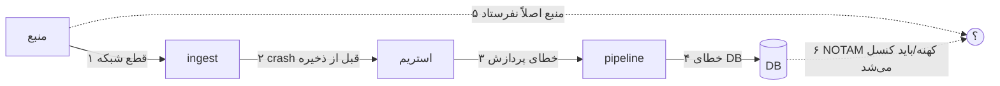
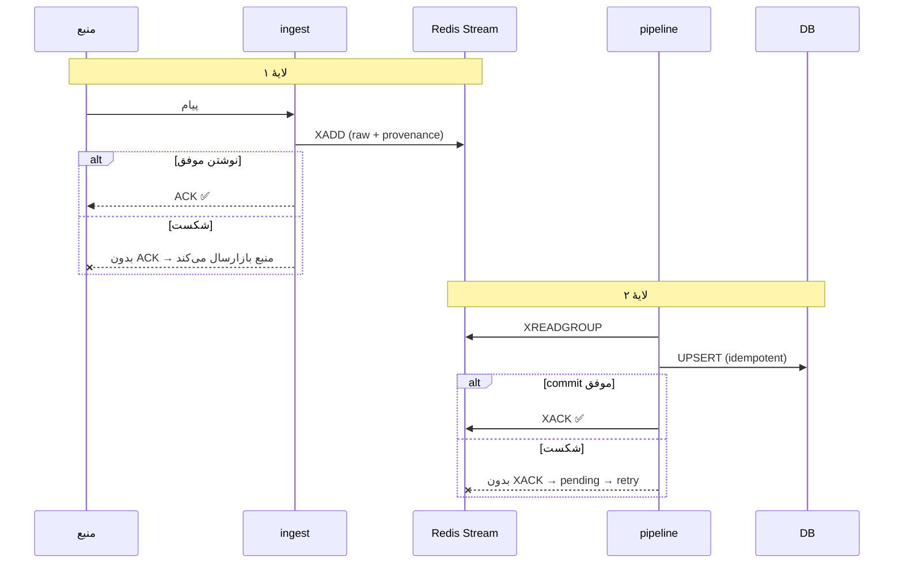
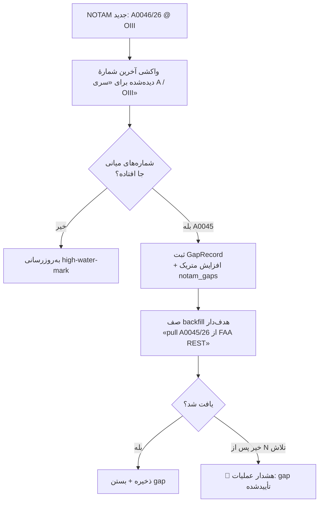
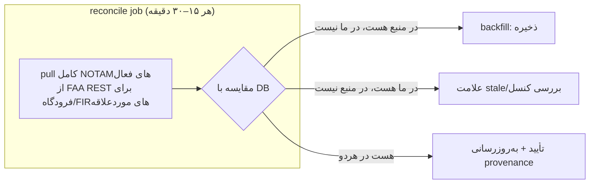
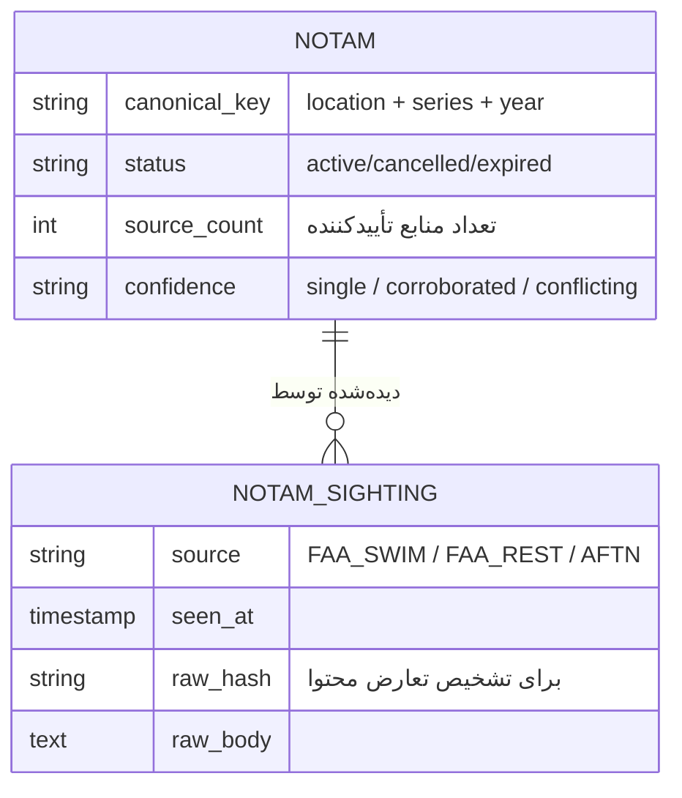
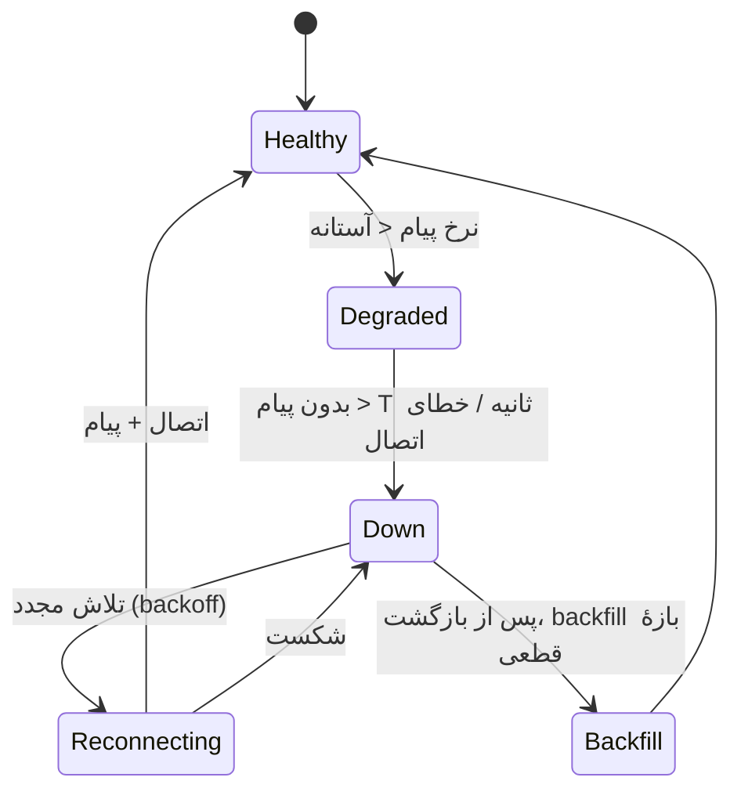
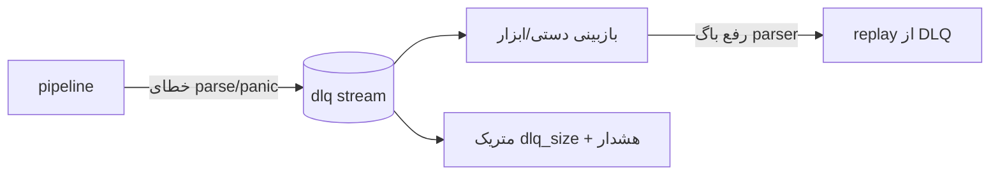
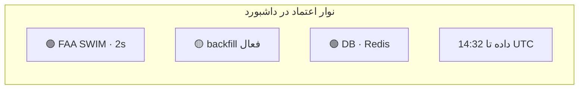

# قابلیت‌اطمینان و اعتمادپذیری (Reliability & Trust)

> این سند مهم‌ترین بخش سیستم است. اصلِ حاکم: **هیچ NOTAMی نباید خاموش گم شود، و اگر سیستم نمی‌داند، باید بگوید نمی‌داند.**

فهرست:
1. [مدل تهدید — چطور داده گم می‌شود؟](#۱-مدل-تهدید)
2. [تحویل تضمین‌شده (ack دولایه)](#۲-تحویل-تضمینشده)
3. [تشخیص Gap](#۳-تشخیص-gap)
4. [Reconciliation و Backfill](#۴-reconciliation-و-backfill)
5. [اجماع چندمنبعی (Consensus)](#۵-اجماع-چندمنبعی)
6. [Liveness و تشخیص قطعی سریع](#۶-liveness-و-تشخیص-قطعی)
7. [Dead-Letter و خطاهای پردازش](#۷-dead-letter)
8. [Idempotency و کلید متعارف](#۸-idempotency)
9. [مانیتورینگ و هشدار](#۹-مانیتورینگ)
10. [نمایش اعتماد در UI](#۱۰-نمایش-اعتماد-در-ui)

---

## ۱. مدل تهدید

جاهایی که یک NOTAM می‌تواند گم شود یا نادیده گرفته شود:

| # | تهدید | دفاع |
|---|-------|------|
| ۱ | قطع شبکه با منبع | Liveness + reconnect + backfill بازهٔ قطعی |
| ۲ | crash اپ بین دریافت و ذخیره | **client-ack پس از نوشتن در استریم** (نه auto-ack) |
| ۳ | خطای پردازش (parse fail) | DLQ + alert، بدون XACK |
| ۴ | خطای نوشتن DB | XACK نکردن → پردازش مجدد؛ idempotent |
| ۵ | منبع اصلاً پیام را نفرستاد | **اجماع چندمنبعی** + reconciliation دوره‌ای |
| ۶ | NOTAM کهنه (باید کنسل می‌شد ولی خبرش نرسید) | reconciliation: هرچه در منبع نیست ولی در ما هست، مشکوک |

---

## ۲. تحویل تضمین‌شده

### الگوی ack دولایه

**قواعد آهنین:**
- Solace از `WithMessageAutoAcknowledgement()` به **client acknowledgment** تغییر می‌کند؛ ack فقط پس از `XADD` موفق.
- `XACK` فقط پس از commit موفق تراکنش DB.
- پیام‌های pending (خوانده‌شده ولی ack‌نشده) با `XAUTOCLAIM` پس از timeout دوباره برداشته می‌شوند (تحمل crashِ consumer).

---

## ۳. تشخیص Gap

NOTAMها در هر «سری» برای هر مکان **شماره‌گذاری ترتیبی** دارند: مثلاً `A0044/26`, `A0045/26`, `A0046/26`. اگر ما `A0044` و `A0046` را دیدیم ولی `A0045` را نه → **یک NOTAM گم شده**.

**جدول `notam_series_watermark`:** برای هر (source, location, series) بیشترین شماره و مجموعهٔ gapهای باز را نگه می‌دارد.

> نکته: شماره‌گذاری همیشه پیوسته نیست (سری‌ها می‌توانند دور بزنند یا FAA بعضی اعداد را رد کند). بنابراین gap ابتدا **مشکوک** است؛ فقط پس از تلاش backfill و ناموفق‌بودن، به **تأییدشده** ارتقا می‌یابد تا false-positive کم شود.

---

## ۴. Reconciliation و Backfill

یک job دوره‌ای (`cmd/reconcile`) که **دیدِ کاملِ منبع مرجع** را با دادهٔ ما مقایسه می‌کند. مکملِ استریم بلادرنگ است.

- **backfill بازهٔ قطعی:** وقتی liveness تشخیص می‌دهد منبع X از ساعت T۱ تا T۲ down بوده، backfill هدف‌دار برای همان بازه اجرا می‌شود.
- **backfill هدف‌دار gap:** برای شماره‌های جاافتادهٔ مشخص.
- **reconciliation کامل:** تصویر کامل برای اطمینان نهایی.

---

## ۵. اجماع چندمنبعی

هر NOTAM یک **هویت متعارف (canonical key)** دارد؛ هر منبع که آن را می‌فرستد یک **sighting** ثبت می‌کند.

**منطق اجماع:**
- اولین منبع → `confidence = single`.
- منبع دوم با همان محتوا → `corroborated` (اعتماد بالا).
- منبع دوم با محتوای متفاوت (`raw_hash` مغایر) → `conflicting` → پرچم برای بازبینی عملیات + نمایش هشدار در UI.
- «آخرین نسخهٔ معتبر» طبق سیاست منبع‌ترجیحی (مثلاً SWIM > REST) انتخاب می‌شود، ولی تاریخچهٔ همهٔ sightingها حفظ می‌شود (audit).

**مزیت:** وقتی AFTN اضافه شود، فقط sightingها بیشتر می‌شوند؛ اطمینان بالا می‌رود و اگر یک منبع NOTAMی را از دست بدهد، منبع دیگر پوشش می‌دهد.

---

## ۶. Liveness و تشخیص قطعی

هر منبع یک نرخ پیام مورد انتظار دارد. سکوت غیرعادی = مشکوک.

- **heartbeat هر منبع:** `last_message_at`, `messages_per_min`.
- آستانه‌ها قابل‌تنظیم per-source (SWIM پرترافیک، AFTN شاید کم‌ترافیک).
- تغییر وضعیت → متریک + هشدار + **نمایش فوری در UI** (نوار وضعیت منابع).
- پس از بازگشت از `Down`، بازهٔ قطعی ثبت و backfill آن اجرا می‌شود.

---

## ۷. Dead-Letter

پیامی که parse/پردازش نمی‌شود، **هرگز دور ریخته نمی‌شود**:

- DLQ شامل: پیام خام + خطا + timestamp + source.
- هشدار وقتی `dlq_size` از آستانه بگذرد.
- پس از رفع باگ parser، امکان replay از DLQ.

---

## ۸. Idempotency

چون at-least-once داریم، پردازش تکراری باید بی‌ضرر باشد:

- **کلید متعارف:** `canonical_key = normalize(location + series_number + year)`؛ در نبود series معتبر، fallback به hash محتوای پایدار.
- ذخیره با **UPSERT** روی `canonical_key` (نه صرفاً `message_id` که بین منابع فرق دارد).
- هر sighting جدا ثبت می‌شود، ولی رکورد NOTAM یکتاست.
- پردازش دوباره → همان نتیجه؛ فقط `updated_at`/sighting به‌روز.

> این یک ارتقای مهم نسبت به وضع فعلی است که کلید یکتا `message_id` (مخصوص Solace) است و بین منابع کار نمی‌کند.

---

## ۹. مانیتورینگ

### متریک‌های کلیدی (Prometheus)

| متریک | نوع | هشدار وقتی |
|-------|-----|-----------|
| `notam_ingested_total{source}` | counter | نرخ به صفر افت کند |
| `notam_source_up{source}` | gauge 0/1 | =0 |
| `notam_source_last_message_seconds{source}` | gauge | > آستانه |
| `notam_stream_pending{group}` | gauge | رشد پیوسته (pipeline عقب) |
| `notam_pipeline_lag_seconds` | histogram | p95 بالا |
| `notam_gaps_open` | gauge | > 0 برای مدت طولانی |
| `notam_dlq_size` | gauge | > 0 |
| `notam_reconcile_backfilled_total` | counter | جهش ناگهانی (نشانهٔ ازدست‌رفتن قبلی) |
| `notam_consensus_conflicts_total` | counter | افزایش |

### داشبورد عملیات
سلامت هر منبع، lag، gapهای باز، DLQ، نرخ ورودی. (Grafana اختیاری در فاز ۱؛ حداقل endpoint `/metrics` و `/health` الزامی.)

### Health endpoint
`GET /api/v1/health` → وضعیت تجمیعی: DB, Redis, هر منبع، lag، gapهای باز. کد ۲۰۰ فقط اگر همه سالم؛ در غیر این صورت ۵۰۳ با جزئیات.

---

## ۱۰. نمایش اعتماد در UI

اعتماد فقط بک‌اند نیست؛ کاربر باید **وضعیت اطمینان** را ببیند:

- **نوار وضعیت منابع:** سبز/زرد/قرمز برای هر منبع + «آخرین دریافت: X ثانیه پیش».
- **برچسب اطمینان روی هر NOTAM:** `تک‌منبع` / `تأییدشده (۲ منبع)` / `⚠ تعارض منابع`.
- **بنر هشدار سراسری:** اگر منبعی down است یا gap باز وجود دارد → «⚠ ممکن است بریفینگ کامل نباشد؛ منبع FAA از ۳ دقیقه پیش قطع است».
- **زمان تازگی داده:** «بریفینگ بر اساس داده تا HH:MM UTC».
- هرگز بریفینگِ «سبزِ کامل» وقتی داده مشکوک است — این اصل شمارهٔ ۲ است.

