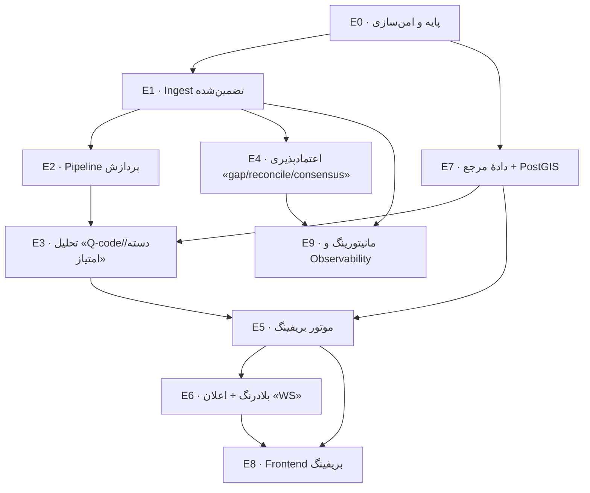

# تسک‌ها و برنامهٔ پیاده‌سازی فاز ۱

> بخش‌بندی کار به **Epic**ها و **Task**ها با اولویت، وابستگی و معیار پذیرش. راهنمای اجرا از پایین (زیرساخت) به بالا (UX).

**راهنمای اولویت:** P0 = پایه و مسدودکننده · P1 = ضروری فاز ۱ · P2 = مهم ولی قابل‌تعویق در فاز ۱.

**راهنمای اندازه:** S (≤۱ روز) · M (چند روز) · L (هفته‌ای).

---

## نقشهٔ کلی Epicها و وابستگی‌ها

---

## Milestoneها

| Milestone | شامل | نتیجهٔ قابل‌نمایش |
|-----------|------|-------------------|
| **M1 — پایهٔ مطمئن** | E0, E1, E2 | NOTAMها با ack تضمین‌شده از استریم وارد و ذخیره می‌شوند؛ بدون data-loss |
| **M2 — فهمِ دقیق** | E3, E7 | هر NOTAM دیکد/دسته‌بندی/امتیازدهی می‌شود؛ دادهٔ مرجع + PostGIS آماده |
| **M3 — بریفینگ پرواز** | E5, E8 (پایه) | کاربر پرواز تعریف می‌کند و بریفینگ مرتب‌شده می‌گیرد |
| **M4 — اعتماد و زنده** | E4, E6, E9 | اعلان بلادرنگ، gap/reconcile/consensus، مانیتورینگ کامل |
| **M5 — پرداخت UX** | E8 (کامل) | نقشه، نوار اعتماد، اخطار بحرانی، تجربهٔ سریع و جذاب |

---

## E0 · پایه و امن‌سازی — P0

پیش‌نیاز همه‌چیز؛ رفع بدهی‌های بحرانی موجود.

| ID | تسک | اولویت | اندازه | معیار پذیرش |
|----|-----|:------:|:------:|-------------|
| E0-1 | خارج‌کردن credentialها (Solace/DB) از کد و compose به env/secret on-prem | P0 | S | هیچ رمزی در گیت نیست؛ اجرا فقط با env |
| E0-2 | جایگزینی auth ثابت با **JWT کوتاه‌عمر + refresh** و کلید امضای واقعی | P0 | M | توکن جعل‌ناپذیر؛ انقضا و refresh کار می‌کند |
| E0-3 | جدول `users` واقعی + هش رمز (bcrypt/argon2) + نقش‌ها (viewer/operator/admin) | P0 | M | ورود با کاربر دیتابیسی؛ نقش در claims |
| E0-4 | بازچینش پکیج‌ها به ساختار ماژولار هدف (`ingest`/`pipeline`/…) | P0 | M | build سبز؛ مرزهای پکیج مطابق ARCHITECTURE |
| E0-5 | راه‌اندازی کلاینت **Redis Streams** (produce/consume/ack/claim) در `data/stream` | P0 | M | تست دود: XADD/XREADGROUP/XACK/XAUTOCLAIM |
| E0-6 | افزودن PostGIS به postgres (image + extension در migration) | P0 | S | `CREATE EXTENSION postgis` موفق |
| E0-7 | چارچوب تست (unit + integration با testcontainers) | P0 | M | CI تست‌ها را اجرا می‌کند |

---

## E1 · Ingest تضمین‌شده — P0

| ID | تسک | اولویت | اندازه | معیار پذیرش |
|----|-----|:------:|:------:|-------------|
| E1-1 | interface `SourceAdapter` + `RawNotamMessage` + `Normalizer` | P0 | S | آداپتورها فقط از این قرارداد استفاده می‌کنند |
| E1-2 | بازنویسی آداپتور Solace با **client-ack** (حذف auto-ack)؛ ack پس از XADD موفق | P0 | M | crash قبل از ذخیره → پیام گم نمی‌شود (تست) |
| E1-3 | reconnect با backoff + ثبت بازهٔ قطعی برای backfill | P1 | M | قطع/وصل شبکه بدون از‌دست‌رفتن؛ بازهٔ قطعی ثبت |
| E1-4 | ثبت `provenance/sighting` هنگام ورود (source, seen_at, raw_hash) | P0 | S | هر پیام منبعش ثبت می‌شود |
| E1-5 | placeholder آداپتور FAA REST (برای backfill/reconcile در E4) | P1 | M | pull بازهٔ زمانی/فرودگاه کار می‌کند |
| E1-6 | (طراحی) placeholder آداپتور AFTN — بدون پیاده‌سازی کامل | P2 | S | interface آماده؛ مستند نحوهٔ افزودن |

---

## E2 · Pipeline پردازش — P0

| ID | تسک | اولویت | اندازه | معیار پذیرش |
|----|-----|:------:|:------:|-------------|
| E2-1 | جداکردن **parser XML/ICAO** از آداپتور Solace به پکیج مستقل تست‌پذیر | P0 | M | تست با نمونه‌های واقعی FAA؛ استقلال از Solace |
| E2-2 | پردازندهٔ استریم (consumer group) + XACK پس از commit DB | P0 | M | at-least-once؛ idempotent |
| E2-3 | محاسبهٔ `canonical_key` + UPSELECT idempotent (جایگزین کلید message_id) | P0 | M | پیام تکراری/چندمنبعی رکورد یکتا می‌سازد |
| E2-4 | ساخت `area` (PostGIS) از مختصات+شعاع خط Q | P1 | M | نقطه/دایره در DB؛ کوئری فضایی کار می‌کند |
| E2-5 | مدیریت NOTAMR/NOTAMC (به‌روزرسانی وضعیت مرجع) روی canonical_key | P1 | M | کنسل/جایگزین درست اعمال می‌شود |
| E2-6 | DLQ برای خطای parse/panic + متریک | P1 | S | پیام خطادار به DLQ می‌رود، گم نمی‌شود |

---

## E3 · تحلیل (Q-code / دسته‌بندی / امتیاز) — P1

| ID | تسک | اولویت | اندازه | معیار پذیرش |
|----|-----|:------:|:------:|-------------|
| E3-1 | جدول کامل Q-code (subject/condition) به‌صورت داده‌محور + دیکدر | P1 | L | نمونه‌های شناخته‌شده درست دیکد می‌شوند |
| E3-2 | fallback تحلیل متن `E)` وقتی Q-code نیست/`XX` (کلیدواژه/الگو) | P1 | M | FICON/RWY CLSD/ILS U/S تشخیص داده می‌شود |
| E3-3 | نگاشت به `category` + `flightPhase[]` + `tags[]` | P1 | M | دسته‌بندی صحیح روی مجموعهٔ آزمون |
| E3-4 | موتور امتیاز پایه (`base_score`/`base_level`) با جدول وزن نسخه‌دار | P1 | L | امتیاز قابل‌توضیح؛ خروجی سطح درست |
| E3-5 | مستند «جدول وزن‌ها» برای بازبینی کارشناس هوانوردی | P1 | S | سند قابل‌ممیزی؛ تغییر وزن بدون تغییر کد |
| E3-6 | مجموعهٔ آزمون طلایی (golden set) NOTAMهای واقعی با نتیجهٔ موردانتظار | P1 | M | تست رگرسیون دقت روی هر تغییر |

---

## E4 · اعتمادپذیری (gap / reconcile / consensus) — P1

| ID | تسک | اولویت | اندازه | معیار پذیرش |
|----|-----|:------:|:------:|-------------|
| E4-1 | جدول `notam_series_watermark` + تشخیص gap هنگام ورود | P1 | M | شمارهٔ جاافتاده تشخیص و ثبت می‌شود |
| E4-2 | backfill هدف‌دار gap از FAA REST + ارتقای مشکوک→تأییدشده | P1 | M | gap پر یا پس از N تلاش هشدار می‌دهد |
| E4-3 | job `cmd/reconcile`: pull کامل + diff (add/stale/verify) | P1 | L | داده‌های جاافتاده backfill؛ stale علامت‌گذاری |
| E4-4 | منطق اجماع چندمنبعی + `confidence` (single/corroborated/conflicting) | P1 | M | چند sighting → confidence درست؛ تعارض پرچم |
| E4-5 | backfill بازهٔ قطعی پس از بازگشت منبع (اتصال به E1-3) | P1 | M | بازهٔ down پوشش داده می‌شود |

---

## E5 · موتور بریفینگ — P1

| ID | تسک | اولویت | اندازه | معیار پذیرش |
|----|-----|:------:|:------:|-------------|
| E5-1 | مدل `FlightPlan` + `FlightAirport` + API ساخت/ذخیره پرواز | P1 | M | CRUD پرواز کار می‌کند |
| E5-2 | تطبیق مکانی aerodrome (location ∈ فرودگاه‌ها) | P1 | S | NOTAMهای فرودگاه‌های پرواز برمی‌گردند |
| E5-3 | تطبیق enroute با PostGIS (کریدور روت ∩ area) + fallback FIR | P1 | L | NOTAMهای مسیر درست انتخاب می‌شوند |
| E5-4 | فیلتر زمانی دقیق (هم‌پوشانی اعتبار + بررسی schedule بند D) | P1 | M | فقط NOTAMهای فعال در پنجرهٔ پرواز |
| E5-5 | امتیاز کانتکستی (`contextual_score`) + `match_reason` | P1 | M | امتیاز وابسته به پرواز؛ دلیل انتخاب ثبت |
| E5-6 | گروه‌بندی + رتبه‌بندی خروجی + خلاصهٔ بحرانی | P1 | M | خروجی مطابق بخش ۷ ANALYSIS |
| E5-7 | کش بریفینگ در Redis + invalidation با NOTAM جدید | P2 | M | بریفینگ گرم < ~۳۰۰ms |

---

## E6 · بلادرنگ و اعلان — P1

| ID | تسک | اولویت | اندازه | معیار پذیرش |
|----|-----|:------:|:------:|-------------|
| E6-1 | WebSocket hub + احراز هویت اتصال | P1 | M | کلاینت متصل و پیام می‌گیرد |
| E6-2 | مدل subscription: کاربر روی پرواز فعالش subscribe می‌شود | P1 | M | فقط NOTAMهای مرتبط push می‌شوند |
| E6-3 | dispatcher: NOTAM جدید → match پروازهای فعال → push | P1 | M | تحویل بلادرنگ (< چند ثانیه) |
| E6-4 | اخطار بحرانی (سطح CRITICAL) با نشانهٔ متمایز + صوت | P1 | S | مورد بحرانی اخطار اجباری می‌دهد |
| E6-5 | حذف polling فعلی فرانت و جایگزینی با WS | P1 | S | فشار سرور کم؛ تأخیر پایین |

---

## E7 · دادهٔ مرجع + PostGIS — P0/P1

| ID | تسک | اولویت | اندازه | معیار پذیرش |
|----|-----|:------:|:------:|-------------|
| E7-1 | مدل `Airport/Runway/Navaid/FIR(geometry)` + مهاجرت PostGIS | P0 | M | جداول + ایندکس GiST |
| E7-2 | ETL فرودگاه/باند/ناوید (OurAirports/NASR) | P1 | L | داده‌های کامل بارگذاری می‌شوند |
| E7-3 | ورود مرزهای FIR (GeoJSON) به PostGIS | P1 | M | `FIRsForRoute`/`ST_Intersects` کار می‌کند |
| E7-4 | نسخه‌بندی + changelog + تشخیص تغییر + هشدار | P1 | M | تغییر باند فرودگاه → ثبت + اطلاع |
| E7-5 | endpoint autocomplete فرودگاه/waypoint (کش‌شده) | P1 | S | جستجوی فوری در فرم پرواز |

---

## E8 · Frontend بریفینگ — P1/P2

| ID | تسک | اولویت | اندازه | معیار پذیرش |
|----|-----|:------:|:------:|-------------|
| E8-1 | افزودن TanStack Query + Zustand + ساختار state | P1 | M | server-state مدیریت‌شده |
| E8-2 | فرم «پرواز جدید» (ADEP/ADES/ALTN/روت + زمان) با autocomplete | P1 | L | ساخت پرواز روان و سریع |
| E8-3 | نمای بریفینگ: خلاصهٔ بحرانی + گروه‌ها + سطوح رنگی + بولد | P1 | L | مطابق بخش ۷ ANALYSIS |
| E8-4 | اتصال WebSocket + toast/بنر NOTAM جدید + اخطار بحرانی | P1 | M | اعلان زنده در UI |
| E8-5 | **نوار اعتماد** (وضعیت منابع + تازگی داده + بنر هشدار) | P1 | M | مطابق بخش ۱۰ RELIABILITY |
| E8-6 | نقشهٔ روت با MapLibre + نقاط NOTAM | P2 | L | روت و NOTAMها روی نقشه |
| E8-7 | صیقل UX/سرعت (skeleton، انیمیشن، RTL، دسترس‌پذیری) | P2 | M | تجربهٔ سریع و جذاب |

> پیش از کار روی UI، skill `ui-ux-pro-max` برای پالت/تایپوگرافی/الگوهای داشبورد استفاده شود.

---

## E9 · مانیتورینگ و Observability — P1

| ID | تسک | اولویت | اندازه | معیار پذیرش |
|----|-----|:------:|:------:|-------------|
| E9-1 | متریک‌های Prometheus (طبق جدول RELIABILITY §۹) | P1 | M | `/metrics` کامل |
| E9-2 | `/health` تجمیعی (DB/Redis/هر منبع/lag/gap) | P1 | S | ۲۰۰/۵۰۳ با جزئیات |
| E9-3 | source liveness state machine + هشدار قطعی | P1 | M | قطع منبع سریع تشخیص |
| E9-4 | لاگ ساختاریافته + correlation id در کل pipeline | P1 | S | ردیابی یک NOTAM سرتاسر |
| E9-5 | داشبورد Grafana پایه (اختیاری فاز ۱) | P2 | M | نمای عملیات |

---

## جمع‌بندی اولویت برای شروع

**هفته‌های نخست (M1) — این ترتیب پیشنهادی است:**
1. E0-1, E0-2, E0-3 (امن‌سازی) — موازی با E0-4 (بازچینش) و E0-6 (PostGIS).
2. E0-5 (Redis Streams) → E1-1, E1-2, E1-4 (ingest تضمین‌شده).
3. E2-1 (جداسازی parser) → E2-2, E2-3 (pipeline idempotent).

پس از M1، داده‌ها **مطمئن** وارد می‌شوند و پایهٔ اعتماد ساخته شده؛ سپس E3+E7 (فهم و مرجع) و E5+E8 (بریفینگ).

> **یادداشت:** این تفکیک برای برنامه‌ریزی است؛ می‌توان آن را مستقیم به issueهای گیت‌هاب/بورد تبدیل کرد. هر تسک باید هنگام شروع، «معیار پذیرش» را به تست تبدیل کند (به‌ویژه E1–E4 که safety-critical هستند).
